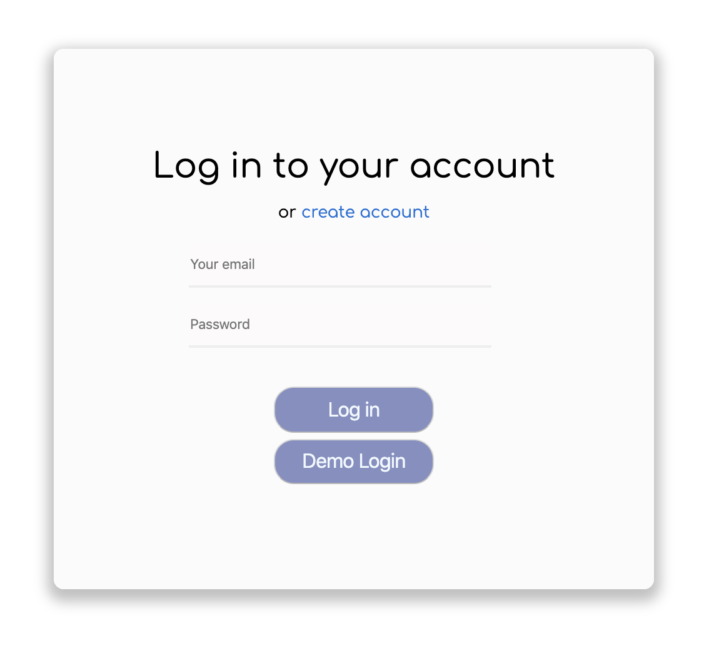

# Questo

## sli.do clone for fullstack project

Check [liveside](https://questodb.herokuapp.com/#/) for live version.


Check [wiki](https://github.com/dbalci/questo/wiki) for design documents.

# Questo
Questo is an app for questions!! This app is collecting questions from a large number of people, who could also vote for questions they thought should be answered. We want to be sure:
    * every question was considered,
    * let the audience see others’ questions,
    * helped the moderator answer the questions that the audience most cared about.


### **Backend:** Ruby on rails

For the backend, ruby on rails used. 
For database choosed Postgres - SQL Database Service Heroku.  
will be using a Node server that utilizes the Express framework for routing and mongoDB for storing data.

### **Frontend:** React, Redux

For the frontend,  React and Redux used frameworks. 

### **Deployment:**  Heroku

Used Heroku for depyoyment.


#### Splash Page

Login modal:



On login form made a demo user first and give th einformation for demo user in a function. On handleDemo function wmpty fields complated with given information. If it's not demo login empty fields going to use update function to update fields with input information. 

```  
constructor(props) {
    super(props);
    this.state = {
        email: '',
        password: ''
    };
    this.handleSubmit = this.handleSubmit.bind(this);
    this.handleDemo = this.handleDemo.bind(this);
}

update(field) {
    return e => this.setState({
        [field]: e.currentTarget.value
    });
}

handleDemo(e) {
    e.preventDefault();

    const demo = {
        email: 'Demo@email',
        password: 'passwordmuacaba?'
    }
    this.props.login(demo).then(this.props.history.push('/events'));
}
```

#### Joining an existing event

By using code of an event you can join the event. 


```
def query
    @event = Event.where(code: params[:code]).first!()
    render :show
end

```

Added query route on events controller and rails routes as:

```     
get 'eventCode/:code', to: 'events#query'
```

With this routes on the frontend findEventByCode function used same route. On redux event actions receive event function bind the findEventByCode promise.

```
    on utils:

export const findEventByCode = (code) => {
    return $.ajax({
        url: `/api/eventCode/${code}`,
        method: 'GET',
        data: { code }
    })
}

    on actions:

export const findEventByCode = (code) => dispatch => {
    return EventAPIUtil.findEventByCode(code)
        .then(event => dispatch(receiveEvent(event)))
}
```

React event index component get this information through event index container with dispaching as same name. And component use this functions to change state information by filled code input.


```
    in container: 

findEventByCode: (code) => dispatch(findEventByCode(code)),

    in component:

handleCode(e) {
        const code = this.state.eventCode;
        this.props.findEventByCode(code).then((response) => {
            event = response.event;
            this.props.history.push(`/events/${event.event.id}`);
        })
    }
```


#### Creating an event 

On event index page, for creating event used modal  feature. Event code is generated automaticly. 
Event start and end date can be modifiyed.  


After creating event, questo automaticly directing user to the event show page. Questions will appear this page. Adding questions and deleting questions also in event show page. If current user is event owner or question owner, can see and use delete questions. Also only event owner can mark answered the question.


Each question will show user informations such as name and question’s creating date and question itself. Side don’t have editing question functionality. Deleting and answerin only functions for questions. Deletion can be question and event owner but answering can be done only event owner. 


When event owner marks a question as answered it will shown as  ‘answered’.


